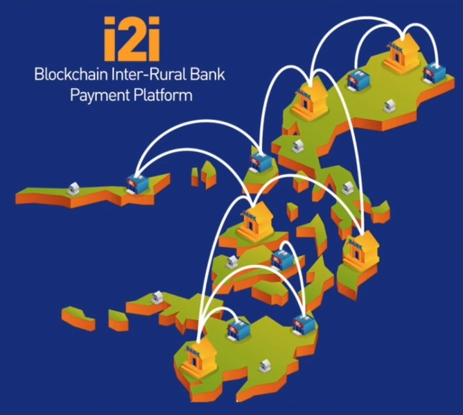

# Case Study: Project i2i - Connecting the Philippines
    Justin Bernier
    11/21/2020
    Unit 1 Homework : FinTech Case Study

## Table of Contents 

### [Overview and Origin](#overview)

### [Business Activities](#activities)

### [Landscape](#landscape)

### [Results](#results)

### [Recommendations](#recommendations)

## Overview and Origin 
* Name and founding of the company
    
    ConsenSys was founded in October 2014 by Joseph Lubin who previously co-founded Ethereum.   ConsenSys seeks to build next-generation decentralized software services and applications that operate on Ethereum.  A particular project of interest is Project i2i - Blockchain Payments in the Philippines. SK Group initially funded ConsenSys with the first round raising $10 million  (source here??)

* How did the idea for the company (or project) come about?

    Joseph Lubin intended ConsenSys to be a software foundry to develop decentralized software services and applications that operate on the Ethereum blockchain.  Project i2i is proof of concept of how Enterprise Ethereum and blockchain can be used to resolve financial service issues that traditional banks are unable to.

## Business Activities 
* What specific financial problem is the company or project trying to solve

    Project i2i seeks to solve the archipelago obstacle in the Philippines and find efficient ways to connect those on islands with less banking infrastructure with a way to easily interact and transact with major banks on the main islands of the Philippines  "it's about connecting the rural banks in the Philippines, to the core banking system of the Philippines in the cities"

* Who is the company's intended customer?  Is there any information about the market size of this set of customers?

	Project i2i targets customers that live outside of main islands and cities in the Philippines and don't have typical banking financial access.  110 million people live in the Philippines and  70% of Filipinos remain unbanked and have no access to traditional bank accounts and 56% of Filipinos residing in rural communities have limited access to financial services ## This ties into the FinTech notion of banking the unbanked and getting financial services to those lacking in this resource.  It is noted that, "operating outside of the banking system hampers upward mobility, long-term opportunities, and perpetuates poverty."
	
    And what we've been building over there together with Union Bank, one of the main banks in the Philippines, is really extending the network of services and the infrastructure extending from the core cities to the rural banks using blockchain technologies. Why we choose blockchain technologies in this case is because it was the easiest way to connect all these different rural banks. There're hundreds of them spread all over the Philippines and connect them back to the existing system. From <https://consensys.net/blockchain-use-cases/finance/project-i2i/> 

* What solution does this company offer that their competitors do not or cannot offer? (What is the unfair advantage they utilize?)

	I think ConsenSys is innovative in this space because of its novel idea to rely on blockchain to standardize, streamline, and reduce cost of transacting with big banks in Philippines realizing the inefficiencies and logistical obstacles given the many of thousands of islands that exist in the Philippines Archipelago.  The partnership with Union Bank, a large bank I the Philippines will allow rural citizens to avail themselves of banking services. 

    ConsenSys  leverage the fact that they were one of the very first blockchain consulting companies and have worked closely with protocol developers and regulatory bodies to ensure their solutions are technically efficient and met standards. 

* Which technologies are they currently using, and how are they implementing them? (This may take a little bit of sleuthing–– you may want to search the company’s engineering blog or use sites like Stackshare to find this information.)

	Tablet (iPad), Web API, Quorum open source blockchain for business.  Ethereum blockchain back-end, programmable money,  smart contracts, digital signatures, Transaction signatures utilizing the Microsoft Azure Key Vault
		
    Rural banks are given an Ipad and an application they can login to and these disconnected rural banks across the archipelago can transact very seamlessly in near real-time and very low cost. 

	Project i2i implemented Enterprise Ethereum to create a decentralized, cost-efficient, real-time inter-rural bank payment platform that operates autonomously outside of existing payment infrastructures and intermediaries such as the Philippines’ PhilPass and SWIFT. The Project i2i platform works to connect rural banks as well as national commercial banks to the central bank, helping remote banks integrate with the domestic financial system while also improving banking access for local citizens.

    Project i2i extended an open Ethereum network that's module that all of these rural banks can connect to.  They can use Ethereum to ensure that transactions have  high degree of integrity and whole process is more efficient and less prone to errors.  Now easy for rural banks to plug in and get connected and they have an automated settlement and clearing system that actually works.  - Blockchain Payments: ConsenSys & Unionbank present Project i2i

## Landscape 
* What domain of the financial industry is the company in?

    Broadly Consensys has services and products across many financial industry domains, but The i2i project focuses on digital banking with plans to expand into payments and remittance.  

* What have been the major trends and innovations of this domain over the last 5-10 years?

    Trends in digital banking and using cell phone applications to increase access to digital banking services has change drastically the last 5-10 years.  There have dozen of banking apps developed, faster online transacting and services like Zelle.  Consumers have been empowered to digitally bank from the convenience of their computer and phone.

* What are the other major companies in this domain?

    Traditional banks, but also FinTech companies out of Silicon Valley that are pressuring traditionally banks to adopt and mature their digital banking platforms and services that are available to consumers.   Square is a great example of a company that is helping people digitally bank, transact, and even buy cryptocurrencies all through an app on their cellphone.  

## Results 
* What has been the business impact of this company so far?

	Some immediate impact of the pilot project for Project i2i include the below:

        - Creation of a verified chronological digital ledger of remittances  
        - immediate visibility of cash inflows and outflows across each partner bank
		- Streamline of banking operations - eliminating at least 20 intermediation steps
		- Faster transaction times and lower costs
		- Easy operability even in low tech settings
		- Intuitive user interface
		- Automated real-time reporting
		- Automated notification of relevant stakeholders for cash settlement operations
		- Real-time liquidity management
		- Automated compliance
	
	https://cdn2.hubspot.net/hubfs/4795067/Project%20i2i%20Case%20Study%20%5BClient%20Ready%5D%20-%20JUNE%202019%20(1).pdf page 6
	
    The 6 month pilot period for Project i2i was a success that created, "Sustainable results and possibilities for a rapidly emerging economy"

* What are some of the core metrics that companies in this domain use to measure success? How is your company performing, based on these metrics?

    Some of the key metrics are centered around performance:  ability to reduce transactions time, streamline manual steps, automate settlement and clearing as well as metrics around adoption rate.  As there is a large portion of the Filipino population without access to regular banking services, upwards of 70 million, the ability to achieve financial inclusion is being measured.
	
    Adoption of Project i2i is just starting, but the successful pilot Program has led to further adoption of blockchain technology in the Philippines.  Transaction time and decrease in manual steps has been substation though with some 20 intermediation steps removed. 

* How is your company performing relative to competitors in the same domain?

	I am not aware of any direct competitors working on a similar project.  ConsenSys as a company has positioned itself as a thought leader and major consulting firm of blockchain technology and has grown substantially to over 1000+ Employees and a valuation of $1 billion. 
        https://www.coindesk.com/consensys-is-seeking-200-million-in-new-funding-report
    
    Performance of the i2i project has been strong as the 6 month pilot period was successful and the project has support from the Central Bank of the Philippines.

## Recommendations 

* If you were to advise the company, what products or services would you suggest they offer? (This could be something that a competitor offers, or use your imagination!)

	Long term success of this i2i project will be the ability of rural residents to use devices like smart phones to interact with digital banking services and easily send/receive payments.   The Philippines is relatively tech oriented, has a large cell phone user base, and has the benefit of a large population that speak English, as it is the second national language.   Creating a cell phone app that interfaces with the rural banks and increases financial inclusion competently will be valuable.  

    Currently rural banks are getting ipad/tablets to interact with i2i, but I would like to see this extended out to consumers.   As mentioned in the case study "The connectivity achieved by Project i2i will be a foundation for many more valuable services that can be built on top of its newly established networks."

* Why do you think that offering this product or service would benefit the company?

    Increased user adoption, increased financial inclusion, empowering consumers through digital banking services on their existing cell phones.  Streamline many of the transportation and logistically issues in getting to rural banks spread across the Philippines.

* What technologies would this additional product or service utilize?

	Possibly an Ethereum dapp if that allowed more straightforward interaction with Quaram But more likely an app that can leverage the same Web API being used to interface with Quaram on this current phase of i2i project.   

* Why are these technologies appropriate for your solution?

    Additional financial services could be rolled out to end users and they interface with the same blockchain tech stack that the rural banks are using to standardized and streamline settlement and clearing activities.  

Be sure to cite your sources in an addendum at the end of the report. List all websites, podcasts, blogs, or articles that you consulted in order to write the report, and provide links. Your list should be thorough and account for all sources you used, but it does not need to be a formal works cited page.